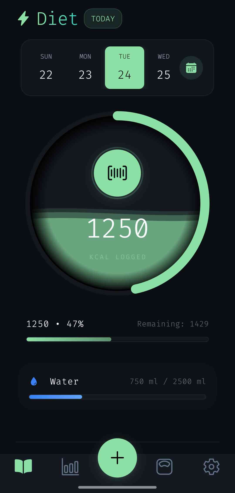

  
  <h1>Anabolic</h1>
  
<b>Health, nutrition, and performance tracking.</b>

  
  
[Downloads](https://img.shields.io/github/downloads/acedmicabhishek/FaceLabsDownload/total)
    
  

 

Discover the ultimate premium tracker designed to elevate your fitness journey. With **Anabolic**, managing your nutrition, physique, and overall health has never been easier or looked better. 

## Features

- **Nutritional Blueprint**: Track your daily calories, protein, carbs, and fats with precision.
- **Body Measurement Tracking**: Track your body measurements with precision.
- **Hydration Tracking**: Track water lol
- **Deep Analytics**: Visualize your consistency and history with beautiful, intuitive charts over weekly, monthly, or yearly periods.

 

  <h3>Ready to see your progress?</h3>
  
  &nbsp;&nbsp;&nbsp;
   

